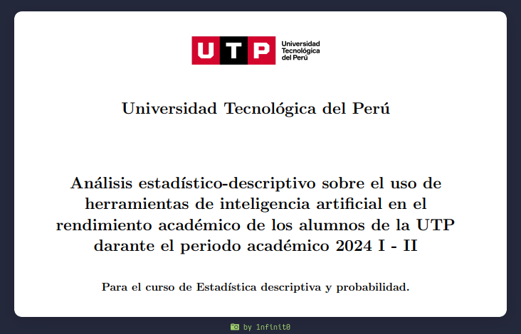

# Análisis estadístico-descriptivo sobre el uso de herramientas de inteligencia artificial en el rendimiento académico de los alumnos de la UTP durante el periodo académico 2024 I - II

## Descripción

Este proyecto presenta un análisis estadístico-descriptivo sobre el impacto del uso de herramientas de inteligencia artificial (IA) en el rendimiento académico de los estudiantes de la Universidad Tecnológica del Perú (UTP) durante el periodo académico 2024 I - II.

El objetivo principal es evaluar cómo el uso de la IA afecta el proceso de aprendizaje, identificando patrones, tendencias y relaciones significativas entre el uso de estas tecnologías y las calificaciones de los estudiantes.

## Metodología

- **Recolección de datos**: Se recolectaron datos a través de un formulario digital, abarcando temas como el género, la carrera, la frecuencia de uso de herramientas de IA y la percepción de los estudiantes sobre su impacto en el aprendizaje.

- **Muestreo aleatorio**: Se empleó un muestreo aleatorio simple para seleccionar la muestra de estudiantes.

- **Técnicas estadísticas**: Se utilizaron técnicas de estadística descriptiva para analizar los datos, incluyendo medidas de tendencia central (media, mediana, moda) y medidas de dispersión (desviación estándar).

- **Visualización de resultados**: Se elaboraron gráficos y tablas de frecuencias para visualizar los resultados obtenidos.

## Resultados

El análisis se centró en los siguientes aspectos:

- **Distribución de género**: Se encontró una mayor representación de estudiantes masculinos en la muestra.

- **Distribución de carreras**: La mayoría de los participantes pertenecen a la carrera de Ingeniería, seguida por Negocios y Psicología.

- **Análisis adicionales**: El informe también incluye análisis sobre la influencia percibida del uso de IA en las notas, el nivel de confianza en los resultados de la IA y la percepción sobre su impacto en la capacidad de pensamiento crítico e investigación independiente.

## Consideraciones éticas

- Se garantizó la confidencialidad y privacidad de los datos de los estudiantes.

- Se obtuvo el consentimiento de los participantes para el uso de sus respuestas.

- Los resultados se presentan de forma anónima y agregada.

## Limitaciones del estudio

- **Tamaño de la muestra**: El tamaño de la muestra puede no ser completamente representativo de la población estudiantil de la UTP.

- **Posibles sesgos**: Existe la posibilidad de sesgos en las respuestas de los participantes.

- **Variables externas**: No se tienen control sobre algunas variables externas que pueden influir en el rendimiento académico.

## Referencias

- Gaviria Peña, C., & Márquez Fernández, C. A. (2019). *Estadística descriptiva y probabilidad*. Editorial Bonaventuriano.

- Vargas Sabadías, A. (1995). *Estadística descriptiva e inferencial*. Servicio de Publicaciones de la Universidad de Castilla-La Mancha, Cuenca.

- Moreno Padilla, R. D. (2019). *The arrival of artificial intelligence to education*. Universidad Tecnológica de Pereira. Recuperado de [Sci-Hub](https://sci-hub.se)

- Sigman, M., & Bilinkis, S. (2024). *Artificial. La nueva inteligencia y el contorno de lo humano*. TE & ET, (37), 244-245. ISSN 1850-9959.

## Estado del proyecto

EL informe se encuentra terminado, teniendo en cuenta la nota aprobatoria y sobresaliente de los involucrados en su desarrollo y redacción, se puede concluir que fue exitoso.
